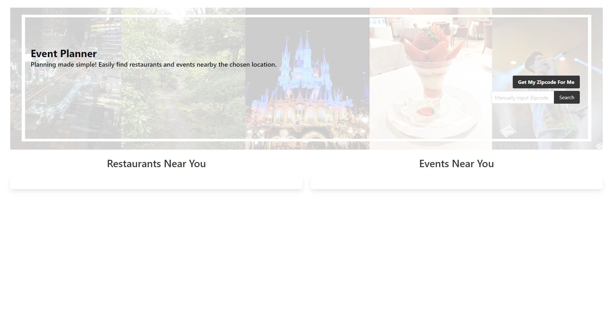
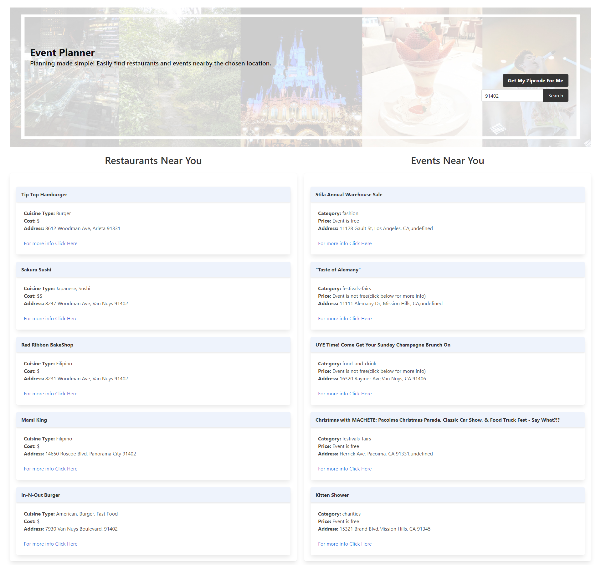

# Event-Planner

## Purpose
Pulling two API's this website allows the user to search nearby restaurants and events. The user is able to either manually input a zipcode of their choice, or click a button that grabs their location's zipcode for them. Five choices of restaurants and events show up giving the user multiple options to decide within their tastes. 

## Made With
* HTML
* CSS 
* BULMA
* JAVASCRIPT
* JQUERY 

## Website Preview

## 

## Contributions by
James Canlas, Ellen Cho, and David Fan

## Deployed URL
https://jcc83267.github.io/Event-Planner/
